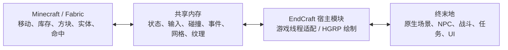

# 实现原理与开发说明

EndCraft 3.0 的核心是两款真实游戏进程、适配模块和共享内存。AI 用于协助开发代码，不在运行时解释每一个方块或替代游戏引擎。

## 数据流

| 部分 | 主要源码 |
|---|---|
| MC 玩法和输入 | `mc/src/client/java/dev/skycraft/client` |
| MC 世界／角色网格输出 | `client/render/WorldExporter.java`、`AvatarExporter.java` |
| 宿主调度与钩子 | `native/actor_reader.cpp` |
| 同步、相机和高度场 | `native/gameplay_bridge.h` |
| 网格、材质与动画纹理 | `native/unity_renderer.h`、`mesh_layers.h` |
| 战斗、保护和载具乘客 | `native/native_combat.h`、`native_interaction.h` |
| 数据布局 | `protocol/endcraft_protocol.h`、MC 的 `link/Proto.java` |

表中的 `client/` 路径位于 MC 的 `dev/skycraft` 包目录。保留 SkyCraft 内部命名以减少上游兼容改动；历史 `SkyState`、`skyrimPid` 在这里代表终末地宿主。

## 同步与坐标

共享内存名为 `Local\EndCraft_v1`，协议版本 12。不同槽位传递宿主／MC 状态、输入、碰撞、事件、渲染网格和 HUD；心跳、序号、世界 epoch 及传送确认用于拒绝失效数据并恢复连接。

当前坐标映射为一个宿主原始单位对应一个 MC 方块，Z 轴反射。独立的宿主原点和 MC 原点构成世界锚点；不沿用 Skyrim 的 70 单位比例。

原生传送、换角色与恢复以宿主当前位置为准。已有世界的 `initial_host_anchor` 在初始化前传入并保存配置，启动时从实际宿主脚部位置接续。初始化后的锚点不可原地重设，避免旧建筑整体漂移。跨不同原生地图的语义锚定仍未完成。

## 输入与线程

宿主通过自己的输入采样把事件放入 MC 输入环。MC 在共享内存锁内复制并提交读取位置，随后在锁外执行输入回调，避免保存退出等待集成服务器时与服务器的共享内存访问相互锁死。

独占模式通过 Host 的钩子链拦截原生键查询及 `InputManager._OnAfterInputUpdate` 绑定分发，并持有桥接自己的角色动作屏蔽句柄。关闭时恢复原生分发；当前 MC 侧仍继续采样，因此不是双方按键对象互斥切换。原生菜单、加载、失联和停用释放屏蔽。

宿主组件调用在游戏线程进行，RPC 接收请求后安排状态变化，不把任意工作线程当作 Unity 主线程。

## 渲染

MC 输出网格、纹理和颜色；宿主将网格变为 Unity Mesh，交给 HGRP 场景绘制，使用原生场景深度。MC 世界绘制被关闭，MC 主渲染目标主要提供手部、HUD 和菜单，其像素通过异步读回传给宿主。

3.0 将实体网格与透明方块／流体拆分。实体批次写深度；透明批次使用 Alpha 混合，不写深度，并按宿主透明队列绘制。MC 三角形平均颜色作为透明批次的材质颜色。玻璃保留碰撞，流体的可选 bit7 标记使其视觉网格不生成实体碰撞体。

`REN_ATLAS_REGION` 更新动画纹理区域，CPU 副本同步更新，多个区域在同一绘制帧合并 Apply。此前忽略此消息导致水等纹理停留在首帧。复杂透明面排序、完整逐顶点光照和水下效果仍有限。

HGRP 无法使用时存在独立深度合成退路；该退路不提供原生建筑遮挡，不能作为同等视觉验收结果。

## 碰撞与实体

宿主附近地形经射线采样转换为高度场／三角形，MC 客户端与服务器据此计算移动。上坡按每个水平移动子步跟随可行走坡面，脚下及邻格使用更密采样。

MC 实体方块创建宿主碰撞网格。碰撞阻挡与 NPC 寻路是两件事：生成碰撞体不代表原生导航系统已经知道新增建筑。高度场也无法完整表达桥下、洞穴、垂直墙面和多层结构。

船和矿车的座位由 MC 乘坐关系管理；宿主本体跟随代理座位，桥接只释放自己取得的移动／AI 控制。下车结合原生地面及 MC 方块检查落点。

## 战斗

MC 为附近敌人创建命中代理，计算实际武器与爆炸伤害。宿主通过 Damage Modifier 流程按目标最大生命映射伤害，再请求 EnemyHurtAnimComponent 处理受击反馈。创造／旁观模式的免伤使用桥接自己的 AllowedDamageMask 句柄，退出保护时撤销。

本地 HP、死亡与任务击杀已有实机证据；缓存 serverHp 未观察到下降，跨会话持久性与奖励未验证。不能只凭接口返回成功或出现伤害数字认定完整战斗兼容。

TNT 场景交互接口查询原生 ECS 碰撞体，并尝试通过原生 BattleHitReactionManager 命中可破坏物。方法名称和强度需来自一次真实原生炸弹样本；校准文件仅存本机，以游戏构建区分有效性。该路径在 3.0 尚未完成实机验收。

## 光影可能性

当前已实现材质透明和动画，不等同于兼容 MC 光影包。

可以先评估让 MC 网格参与宿主光照和阴影：补齐法线、材质参数及投影路径，再研究原生水面反射。这适合现有 HGRP 架构，但还未完成实测。

[Iris](https://github.com/IrisShaders/Iris) 提供 MC 光影包加载能力；EndCraft 当前关闭了 MC 世界绘制，所以单纯装入 Iris 不会让导出的 Unity 网格自动得到光影。完整方案需要恢复／适配 MC 绘制通路，传递颜色与深度并与宿主合成；跨引擎相互投影及水面反射还需要双方几何或缓冲数据。当前 MC 版本与依赖也需单独验证，不承诺任意光影包即装即用。

## 版本与验证

固定依赖及许可见 [第三方声明](../THIRD-PARTY-NOTICES.md)。3.0 构建使用 JDK 25、MC 26.3、Fabric Loader 0.19.5、Fabric API 0.161.0+26.3、Loom 1.17.21、Gradle 9.6.1。

验收区分自动测试、接口调用、状态变化和用户观察。最新证据见 [第 31 版](VALIDATION-gameplay31.md)、[第 33 版](VALIDATION-gameplay33.md)，2.0 基线见 [第 27 版](VALIDATION-gameplay27.md)。本机 `reports/` 是私有诊断目录，不随发行附件分发。
